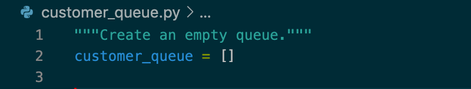
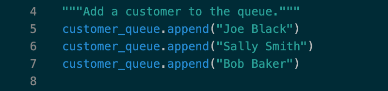
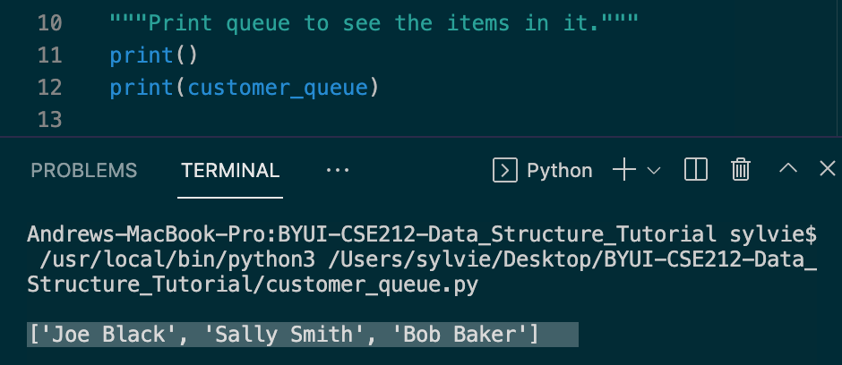
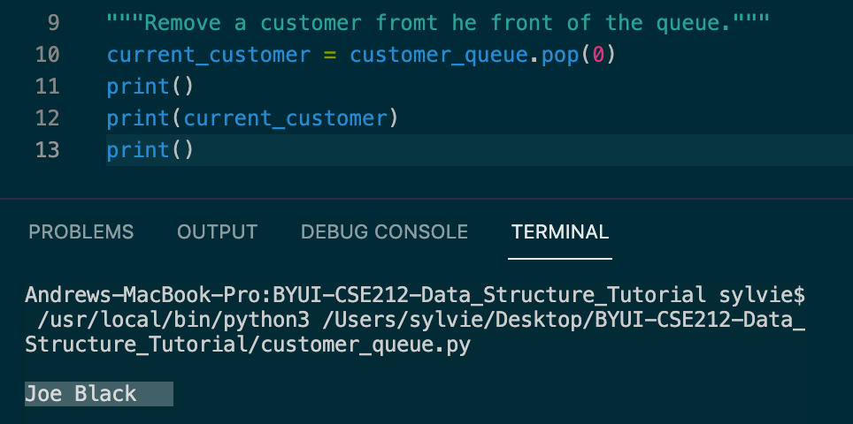

# Python Data Structure Tutorial

Welcome to my Data Structures Tutorial. This tutorial covers three data structures in Python. Each topic includes some instruction, examples and a practice problem.

1. [Queues](queues.md)
2. [Linked Lists](linkedLists.md) 
3. [Trees](trees.md)

## Queues:

    A queue in computer programming is a data structure, much like a line, in which items are processed in a FIFO (First In First Out) order. The first item in the queue is called the front. The last item in the queue is called the back. As items are added to the queue we 'enqueue', or add, the item to the back of the queue. If there are no items in the queue then the added item becomes the first item in the queue. As items are processed they are 'dequeued', or removed, from the queue. The first item in the queue is alway the first item to be processed or dequeued. Consider a line of customers. The first person in line will be served first. The last person to enter the line will be the last person to be served.
    
## Real World Example:

    Servers receive requests from computers all over the world for webpages. Each request requires the server to send information back to the computer requesting the information. The server does not process these requests simultaneously. So a queue data structure is created to process each request in the order it was received, 'First In First Out'. 

## Queues in Python

In Python we have several methods in place to help us process queues: 
    
    To enqueue (add) an item we use the append() method.
   **queueName.append(itemName)**

    There are two ways to dequeue (remove) an item.
   **itemName = queueName[0]**
   **del queueName[0]**
   or
   **itemName = queueName.pop(0)**
    
    To check the size of a queue we use the *size()* method. It will return an integer value of how many items are in the queue.
   **size = len(queueName)**

    To check to see if a queue is empty we can use the *empty()* method. It will return a boolean value (True or False). If the queue is empty the value returned will be True.
   **if len(queueName) == 0:**

## Big O Notation

    
    Performance of queues can be measured using Big O Notation. When manipulating queues using enqueue(), size(), and empty(), the performance is O(1). These operations have the same runtime regardless of the size of data in the queue. When we dequeue an item from a queue, the operation has an O(n) runtime. This is a linear performance that increases as the data in the queue increases.

## Example

    In the example below we will add and remove customer names to a queue.

    First we create an empty queue by declaring a variable name for the queue and use the assignment operator to empty brackets.

    Then we enqueue (add) a few customer names to the queue using the append() method.

    We can display the results of our queue to confirm our customers names have been added to the queue.

    Then we dequeue (remove) the first customer using the pop() method.

    

## Problem to Solve

    In this problem you need to write code to check if a queue is empty or not.

1. Create a queue named "customers".
2. Write the code to check if the queue is empty.
3. Enqueue three customer names.
4. Check if the queue is empty again.

    
